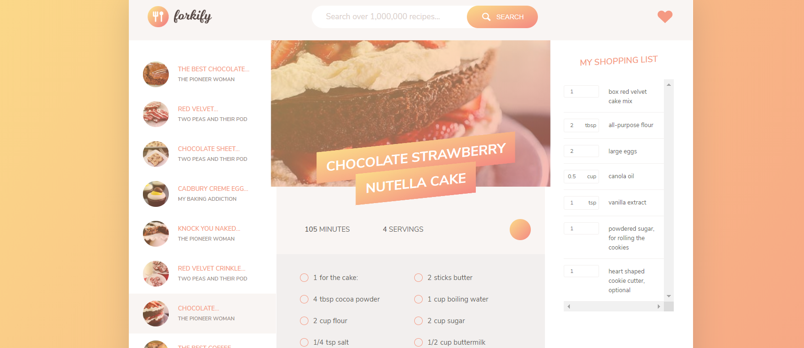
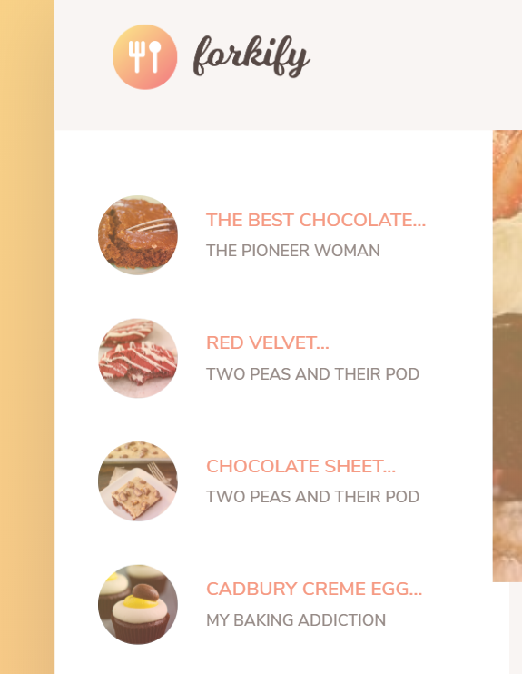

# Forkify

#### Forkify is a app you can get recipe of your choice. Once you select recipe you can get ingredient of the perticular recipe and add to your shopping list. You can also add or delete items you don't need to buy. If you like any recipe you can add/delete in your favorite recipe by clicking heart icon.

### Demo :

### Screenshot:

### Technologies:

<li>HTML 5</li>
<li>CSS 3 </li>
<li>JavaScript</li>

### If there is long title then this code will make ... after maximum 17 letter

### 

```
export const limitRecipeTitle = (title, limit = 17) => {
  const newTitle = [];
  if (title.length > limit) {
    title.split(" ").reduce((acc, cur) => {
      if (acc + cur.length <= limit) {
        newTitle.push(cur);
      }
      return acc + cur.length;
    }, 0);

    return `${newTitle.join(" ")}...`;
  }
  return title;
};

```

### With this code you add or delete ingredient for shopping list

### 

```
export default class List {
  constructor() {
    this.items = [];
  }

  addItem(count, unit, ingredient) {
    const item = {
      id: uniqid(),
      count,
      unit,
      ingredient
    };
    this.items.push(item);
    return item;
  }

  deleteItem(id) {
    const index = this.items.findIndex(el => el.id === id);
    this.items.splice(index, 1);
  }

  updateCount(id, newCount) {
    this.items.find(el => el.id === id).count = newCount;
  }
}

```
